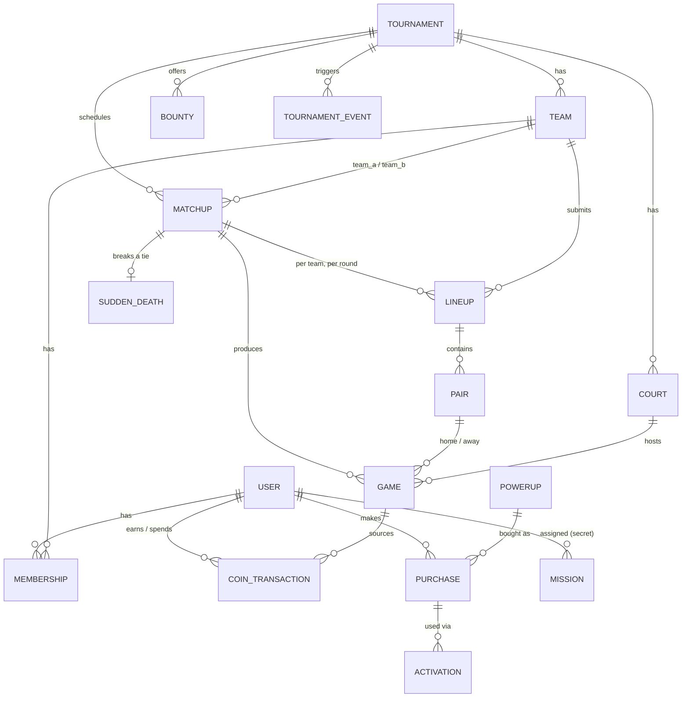
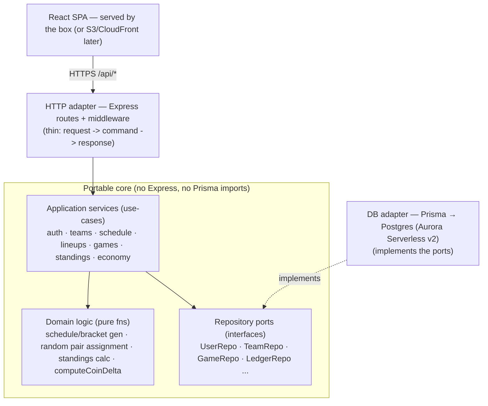

# Friendsgiving Badminton Tournament — Design

> **Status:** Living design doc. **Implementation in progress** — Phase 0 Part 0
> (foundation + health), Part 1 (auth, roster, captains — US1–US3), Part 2
> (round-robin schedule generation + court assignment — US4–US5), Part 3
> (captain lineups, validation, random pair assignment — US6–US8), Part 4
> (match scoring + standings/seeding — US9–US10), Part 5 (playoffs, sudden
> death — US11–US12), and Part 6 (multi-tournament + per-tournament access —
> **US28**, minus the coin-reset piece deferred with the rest of the economy)
> have landed. **Phase 0 is complete.** Next up: Phase 1 (economy). Owner:
> @jhou98. Last updated: 2026-09-14.
>
> **Changelog (2026-09-14) — no ties (reverses D19):** round-robin draws are gone.
> A round-robin matchup with a level game tally now behaves exactly like a tied
> playoff matchup: it stays `in_progress` and goes to **sudden death** (same
> rep-pick + 1v1 flow, same `sudden_death_rule`) — the winner is credited the
> round-robin win. `isTiedPlayoff` (sudden-death service) is renamed
> `isTiedMatchup` and no longer gates on stage. **Standings** drop **points**
> and the tie column entirely: `MATCHUP_POINTS`/`StandingRow.points`/
> `matchupsTied` are removed, and ranking is now **matchups won → game
> differential → point differential → team name** (equivalent to the old
> points sort once ties can't happen). UI shows **W-L** (no `-T`). **Admin edit:**
> `POST /api/admin/matchups/:id/sudden-death` no longer rejects a resubmit —
> an admin can correct a wrong sudden-death score/rep-side after the matchup
> already finalized (mirrors the existing re-editable `PATCH /api/admin/games/:id`).
> The `Overtime` component (Results + Captain Panel) now shows the score form
> alongside a recorded result, pre-filled, so admins can edit in place; its UI
> label changes from **"Overtime"** to **"Sudden death"** for both stages (the
> round-robin-only **"Tie"** pill is gone — a tied round-robin matchup now shows
> the same **"Sudden death"** pill as a tied playoff matchup). **Results:** the
> per-game score button always reads **"Save"** (was "Edit" once a score existed).
>
> **Changelog (2026-09-13) — UI refresh:** the client was rebuilt on the warm
> "Friendsgiving" look from `artifacts/example-design-25.png`: **Tailwind v4** (tokens in
> `client/src/index.css` via `@theme`; shared primitives in `client/src/components/ui.tsx`),
> a dark **sidebar shell** (`components/layout/AppShell.tsx`, collapses to a drawer on
> mobile), and a new information architecture — **Home** dashboard at `/` (live banner,
> stats, recent results, my team, standings snapshot), **Tournament Tracker** at
> `/tournament/{schedule,results,standings}` (tabbed), **Captain Panel** at `/captain`
> (was Lineups), **Admin Panel** at `/admin/{users,teams,tournaments,settings}` (tabbed),
> **Profile** at `/profile`, and a split-hero **Login/Signup**. Old flat routes redirect.
> **Future phases are wired in already:** `client/src/lib/nav.ts` declares Leaderboard /
> Shop / Missions as `comingSoon` sidebar entries (muted "Soon" pill + placeholder page) —
> enabling one is a one-line change; `lib/types.ts` holds the shared API view types for
> new pages to extend. **No API or server changes.** Part of P3's mobile-friendly goal
> (US27) lands with this (responsive layouts), the rest of P3 stays open.
>
> **Changelog (2026-09-13) — Part 6:** **US28 (multi-tournament) shipped**, scoped
> to what Phase 0 covers (teams, schedule, scores, results, standings, playoffs) —
> the **coin-reset minimum bar is intentionally deferred to Phase 1** with the rest of
> the economy (coins aren't built yet). The single-tournament `findFirst` is gone:
> a new **`TournamentService`** resolves the **active tournament per request** and
> gates access — a new **`resolveTournament` middleware** reads an `X-Tournament-Id`
> header (falls back to a `?tournament=` query, then to the caller's sole tournament),
> and every scoped service method now takes an explicit `tournamentId` (compiler-checked
> across all call sites). **Access:** admins see all tournaments; everyone else sees only
> the ones they're rostered in (via `MembershipRepo.listByUser`) — requesting one you're
> not in is a 404, and `/api/me`'s role is now resolved **per active tournament**. New
> routes: **`GET /api/tournaments`** (accessible list) and **`POST /api/admin/tournaments`**
> (create from `DEFAULT_TOURNAMENT_CONFIG`, shared with the seed). **Client:** the active
> id rides an `X-Tournament-Id` header (localStorage-backed), a nav **tournament switcher**,
> an Admin **Tournaments** section (create + activate), and routed pages remount on switch
> so per-tournament data refetches. **No schema change / no migration** — every scoped table
> already carried `tournament_id`. Verified end-to-end: per-tournament roster isolation,
> membership-gated access (404 for non-members), and admin-only guards (403).
>
> **Changelog (2026-09-13) — Part 5:** US11–US12 shipped, plus a matchup-matching
> fix. **Playoffs (US11):** `POST /api/admin/playoffs/seed` seeds the bracket from final
> round-robin standings (top `playoff_qualifiers`; supports **2 or 4** — the `semifinal|final`
> enum) → `#1v#4` / `#2v#3`; `status → playoffs`. Advancement is **idempotent** (`sync`,
> called after every score/sudden-death write): the **final is created from the two semifinal
> winners** (deferred so team columns stay non-null), and a decided final sets
> `status → completed` (champion = final winner). **Sudden death (US12):** a tied (3–3)
> playoff/final leaves the matchup undecided; each captain picks one eligible rep
> (`POST /api/matchups/:id/sudden-death/rep`), an admin enters the 1v1 result
> (`POST /api/admin/matchups/:id/sudden-death`, validated **first-to-5 / win-by-2 / cap-7**),
> and the winner finalizes the matchup → advancement. `sudden_death` rows are now nullable
> (reps persist before the score; **migration** `…_sudden_death_nullable_and_bracket`).
> **Matching-timing fix:** random pair assignment now fires only once **every** lineup in a
> matchup (both teams, all rounds/matches) is locked — never per match — so a captain can't
> read the opponent's revealed pairs for one match while another is still unlocked. Admins can
> **re-randomize** a fully-locked, unscored matchup (`POST /api/matchups/:id/lineups/rematch`)
> if a draw looks lopsided (D12). Standings/seeding count **round-robin only**.
>
> **Changelog (2026-09-13) — round-robin ties (D19):** since sudden death is **playoff-only**,
> a round-robin matchup with a level game tally is now a **completed draw** (finalizes with no
> winner) instead of dangling `in_progress`. Standings show **W-L-T** and rank by **league
> points (win 3, tie 1, loss 0)** → game diff → point diff → name. **UI labels:** a round-robin
> tie shows **"Tie"** (no sudden-death wording); a playoff tie's 1v1 decider is shown as
> **"Overtime"** — the `sudden_death` table/API name is unchanged (UI relabel only). The overtime
> UI splits by page: **rep selection (setup) on Lineups**, **result entry (scoring) on Results**
> (shared `Overtime` component, `mode="setup"|"scoring"`); editing a decided final back to a tie
> **re-opens** the tournament (`completed → playoffs`). Fixes the "0-0 record but 1-1 games"
> artifact. Also fixed a Lineups UX bug: saving/locking one side no longer wipes the other side's
> unsaved draft (drafts are matchup-scoped and preserved across refetches).
>
> **Changelog (2026-09-13) — Part 4:** US9–US10 shipped. Admins enter/edit a per-game
> score via `PATCH /api/admin/games/:id` (`{scoreHome, scoreAway, courtId?}`); a game must
> have assigned pairs, scores are non-negative ints, and a tie is rejected (badminton games
> have a winner). Scoring sets the winning pair, marks the game `final`, and **recomputes the
> matchup**: per-match round score (e.g. `2–1`) and overall matchup score auto-derive; a
> decided matchup sets `winnerTeamId` + `status = final`, a level game tally stays
> `in_progress` awaiting sudden death (US12). Editing a final result re-derives everything
> (US9). New `GET /api/results` (per-matchup match/matchup scores, revealed pairs) and
> `GET /api/standings` (record → game diff → point diff → name; final ranks seed playoffs)
> are read-only for any signed-in user, plus **Results** and **Standings** pages. Standings
> are **derived at view time** (no `standing` table). No schema change — the `game` score
> columns and `matchup.status`/`winnerTeamId` were already modeled in Part 2.
>
> **Changelog (2026-09-12) — Part 3:** US6–US8 shipped. Captains (or admins) submit
> `pairs_per_lineup` doubles pairs per round from their roster; validation enforces the
> right pair count, on-roster players, no player in two pairs a round, no duplicate
> pairing within a matchup (US7). Submit → lock; once **both** sides lock a round the
> system **randomly matches** home vs away pairs (Fisher–Yates, injectable RNG) and fills
> the pre-created game shells → `assigned` (US8). Opponent pairs stay hidden until both
> lock (reveal). Admins can **unlock/override**, which clears a non-final round's random
> assignment so it can be re-picked and re-matched. New `/api/matchups*` routes + a
> captain **Lineups** page. No schema change (Part 2 already modeled lineup/pair/game).
>
> **Changelog (2026-09-12) — Part 2:** circle-method round-robin generation
> from config, per-game court assignment, admin config editing, manual team swaps and
> court reassignment. Added a `round_robin_cycles` config knob (default 1) so admins
> can repeat the whole round robin (e.g. a double round robin) without unbalancing it.
>
> **Changelog:** Reworked P0/P1/P2 against the *Vibe Coding User Stories* doc, then
> reconciled §3–§11 to match. The tournament is now **team → captain → pairs** with a
> **richer economy** (individual player coins, bounties, losing-streak protection,
> secret missions, commissioner events). **Dropped:** sub-team hierarchy (old US14 /
> D2, D11–D14), **team** coin wallets (coins are now **per player**), and Excel import.
> **Notifications are out of scope.**
>
> **Configurable, not hardcoded:** the reference tournament is 24 players / 4 teams
> of 6 / 3 round-robin rounds, but team count, team size, pair size, pairs per
> lineup, rounds per matchup, playoff qualifiers, and court count are all **config**
> (§4 *Tournament config*), and the schedule/bracket generate from them.

---

## 1. Product summary

A web app to run a 24-person Friendsgiving badminton tournament. The tournament
has a **fixed shape**: **24 players → 4 teams of 6**, each with **1 captain**.
Teams play a **3-round round robin** (every team plays every other once); each
team matchup is **two rounds of doubles**, each round **3 doubles games**.
Captains pick their team's **three pairs** per round and the **system randomly**
matches them against the opponent's three pairs. Standings rank by **team record,
then game differential**, and seed **playoffs** (#1 vs #4, #2 vs #3 → finals),
with **1v1 sudden death** breaking a 3–3. Later phases layer on an **economy**
(per-player coins, match rewards, losing-streak protection, bounties), a
**power-up shop** (incl. a playoff shop), and **commissioner** tools (secret
missions, tournament-wide events).

- **Scale:** exactly **24 players, 4 teams of 6**, **6 courts** (all six doubles
  games in a round can run at once).
- **Roles:** three — **Player**, **Captain**, **Admin/Commissioner** (§ roles below).
- **Hosting target:** AWS free tier.
- **Auth posture:** simple — it's a friends' game.

---

## 2. Prioritized user stories (source of truth)

Grouped by priority. **P0 = the tournament engine + permissions** — build and
harden this before styling anything (the hard part is captains → lineups →
random matchups → results → standings → playoffs, not the UI). **P1 = economy**,
**P2 = power-ups + commissioner**, **P3 = polish**. Notifications are out of scope.

### P0 — Tournament engine & permissions (Phase 0)

| ID | Story |
|----|-------|
| US1 | User can create an account and log in; the system supports three roles: **Player**, **Captain**, **Admin/Commissioner** |
| US2 | Admin can add/remove the **24 players** and assign each to one of **4 teams of 6** (manual reassignment; optional random balanced generation) |
| US3 | Admin assigns exactly **1 captain** per team; player can view their profile, their team, and their captain |
| US4 | System auto-generates the **3-round round robin** (every team plays every other once, one game per round); admin can manually edit the schedule |
| US5 | Admin assigns games to **courts** (6 available) and can change court assignments |
| US6 | Captain selects **3 doubles pairs** from their 6 players for each round, with new pairs allowed each round; can view availability, past pairings & results before choosing |
| US7 | Lineup validation: exactly **3 pairs / 6 players**, no player in two pairs in a round, no duplicate pairing within a matchup; captain **submits and locks**, admin can unlock/override |
| US8 | Once **both** lineups lock, the system **randomly matches** the 3 pairs vs the opponent's 3 pairs; assignment is recorded and revealed to players |
| US9 | Admin enters per-game scores; round score (3–0 … 0–3) and overall matchup score auto-calculate; players view results; admin can edit a final result |
| US10 | Standings track team record, games won/lost, **game differential**, ranking; auto-rank by **record → differential → tiebreaker**; final standings seed playoffs |
| US11 | **Playoffs:** semifinals **#1 vs #4** and **#2 vs #3**, each two rounds of 3 doubles (new pairs + random matchups per round); most total wins advances; **finals** use the same format and declare the champion |
| US12 | **Sudden death** on a **3–3** playoff/final: captain picks one eligible representative, admin enters the result separately (**1v1, first to 5, win by 2, cap 7**); winner advances |
| US28 | **Multi-tournament + per-tournament access:** admin creates and manages **multiple tournaments**, each with its own config, teams, schedule, results, standings, **and coin ledger**; a signed-in user sees only the tournaments whose team they belong to (admins see all), and picks the active one; **all data — including coins/economy — is scoped by `tournament_id`** so nothing (least of all balances) bleeds across events. **Minimum bar:** even before full per-event scoping lands, an admin can **reset all coin balances for a tournament** so a new event starts clean. **✅ Shipped (Part 6):** multi-tournament CRUD + per-request active-tournament resolution + membership-based access + `tournament_id` scoping across all Phase-0 data. **Deferred to Phase 1:** the coin ledger scoping + coin-reset, which land with the economy (coins aren't built yet). |

### P1 — Economy (Phase 1)

| ID | Story |
|----|-------|
| US13 | Each **player** has an individual coin balance, auto-updated after every match, with a visible reason and full transaction history |
| US14 | Match rewards credit coins by result (**win / close loss / loss**), with admin-configurable thresholds |
| US15 | **Losing-streak protection:** escalating bonus after consecutive losses, resets after a win; amounts admin-configurable and auto-calculated |
| US16 | **Bounties:** admin creates bounties on a player/team with a coin value and conditions; players see active bounties; completion is auto-detected; bounties **stack**; admin can add custom bounties mid-tournament |
| US17 | Admin can manually adjust/reverse coins; every transaction is recorded in an **audit log** |
| US18 | **Coin leaderboard** across players |

### P2 — Power-ups & commissioner (Phases 3–4)

| ID | Story |
|----|-------|
| US19 | Admin creates power-ups (name, description, price, category, restrictions); can set prices and activate/deactivate |
| US20 | Player browses the shop, sees price + effect, and **buys with coins**; purchases blocked without sufficient coins; player sees owned inventory and used/unused state |
| US21 | Power-up **activation timing** is defined per power-up; player activates through the site; activations are timestamped and used power-ups leave inventory; admin can override |
| US22 | **Playoff shop** opens after pool play; coins carry over; playoff-exclusive power-ups, per-player purchase limits with remaining stock; admin can close it before the final |
| US23 | **Secret missions:** commissioner secretly assigns a mission + coin reward + expiration round to a specific player; player sees only their own; commissioner marks complete to award; hidden from everyone else |
| US24 | **Tournament events / chaos:** commissioner creates tournament-wide events scoped to a round/games, activates instantly, auto-expires; active events shown on the dashboard |

### P3 — Polish (Phase 5)

| ID | Story |
|----|-------|
| US25 | **Live tournament dashboard** (standings, current round/courts/scores, coin leaderboard, active bounties, active events) that updates as results are entered |
| US26 | **Captain dashboard** (team, upcoming matchup + lineup/submission status, team history, strategic resources) |
| US27 | Tournament **history / activity log** view, animations, and a **mobile-friendly** interface |
| US29 | Security Setup - App should automatically clean and parse any attempts at SQL injection |
| US30 | Traffic Protection - App should implement basic rate limiting and firewall to filter out malicious traffic |

> **Removed vs. prior artifact:** sub-team hierarchy, **team** coin wallets (coins
> are now per-player), Excel import, and **open-join / self-serve invites** (admin assigns
> rosters, D3). **Notifications** are intentionally omitted. *(Multi-tournament is back
> **in** scope as a P0 story — US28 / D6 — so coins and everything else scope per event.)*

---

## 3. Vocabulary

**Points vs. coins** — named separately so stories don't collide:

| Term | Meaning | Source |
|------|---------|--------|
| **Game score** | Raw per-game result, e.g. `19–16` | Reported per game |
| **Point differential** | Σ(score_for − score_against) over final games | Derived for standings |
| **Coins** | Spendable currency for the power-up shop — held **per player** | Earned per match, mission, and streak bonus (pluggable rule, D4) |

**Tournament-shape terms** (all quantities are **config**, §4 — defaults in parens):

| Term | Definition |
|------|------------|
| **Round** | A round-robin **slate**: the grouping in which every team plays once (count derived from `team_count`). `round_robin_cycles` repeats the whole set of rounds. *(field: `round_index`)* |
| **Team** | A flat group of players with exactly **one captain**. No sub-teams. |
| **Matchup** | One team vs. another within a round; consists of `rounds_per_matchup` (2) **matches**. |
| **Match** | One doubles round *inside* a matchup: each team fields `pairs_per_lineup` (3) pairs → that many **games**. *(fields: `round_no` per game/lineup, `rounds_per_matchup` config)* |
| **Game** | A single doubles game — one home pair vs. one away pair. |
| **Set** | *Future (not built):* a scoring unit within a game; a game may be played as multiple sets. |
| **Pair** | `pair_size` (2) players fielded together in one game. |
| **Lineup** | One team's set of pairs for one **match** of a matchup — submitted & locked by the captain. |

> **On the word "round":** the round-robin **Round** (a slate of matchups, `round_index`)
> is a *different* level from a **Match** (a doubles round inside one matchup, `round_no` /
> `rounds_per_matchup`). The hierarchy is **Round → Matchup → Match → Game → (future) Set**.
> The code keeps the `round_index` / `round_no` / `rounds_per_matchup` identifiers; the UI
> uses the words **Round / Match / Set**.

*"Coins" is a placeholder name — rename freely.*

---

## 4. Proposed data model

> Starting proposal to react to. Everything about tournament *shape* lives in
> **Tournament config** below, so the same schema runs a 4-team / 6-per-team event or
> any other. Teams are **flat** (captain + members, no sub-teams); coins are a
> **per-player** ledger.



### Tournament config (the knobs — nothing below is hardcoded)

Stored on the `tournament` row (or a small `settings` table); editable while
`status = setup`, frozen once the schedule generates.

| Key | Default | Meaning |
|-----|---------|---------|
| `team_count` | 4 | Number of teams in the tournament |
| `team_size` | 6 | Players per team (validate as a min/max range, not a hard equal) |
| `pair_size` | 2 | Players per pair (doubles = 2) |
| `pairs_per_lineup` | 3 | Pairs each team fields per **match** ⇒ games per match — UI: "Pairs / match" |
| `rounds_per_matchup` | 2 | **Matches** (doubles rounds) in one team matchup — UI: "Matches / matchup" |
| `round_robin_cycles` | 1 | How many times the whole round robin repeats (2 = double round robin) |
| `playoff_qualifiers` | 4 | Top-N teams that advance to the seeded bracket |
| `court_count` | 6 | Courts available for concurrent games |
| `coin_rule` | JSON | Pluggable earning formula (D4) |
| `streak_rule` | JSON | Streak-bonus config incl. **direction** (`loss` \| `win` \| `both`) + tiers — D16 |
| `sudden_death_rule` | JSON | `{ first_to: 5, win_by: 2, cap: 7 }` |

**Derived, never stored:** round-robin round count (`(even: team_count − 1 | odd: team_count) × round_robin_cycles`), `games_per_matchup = rounds_per_matchup × pairs_per_lineup`, and the tie score that triggers sudden death (`games_per_matchup / 2`, when that split is possible).

### Core tables (P0)

**user** — `id`, `username` (unique), `display_name`, `password_hash`, `is_admin` (bool), `created_at`

**signup_invite** — `id`, `code` (unique), `grants_admin` (bool), `created_by` (user_id), `expires_at` (nullable), `used_by` (user_id, nullable), `used_at` — *admin sign-up codes (D1).*

**team** — `id`, `tournament_id`, `name`, `created_at` — *flat; unique name per tournament. No parent/depth/join_code.*

**membership** — `id`, `user_id`, `team_id`, `role` (`captain` | `member`), `created_at`
*(unique `user_id`+`tournament_id` — a user is on **one** team per tournament; exactly **one** `captain` per team; roster size validated against `team_size`. Admin assigns players and may auto-generate balanced teams.)*

**matchup** — `id`, `tournament_id`, `stage` (`round_robin` | `semifinal` | `final`), `round_index` (RR round #, nullable in playoffs), `bracket_slot` (nullable), `team_a_id`, `team_b_id`, `status` (`scheduled` | `in_progress` | `final`), `winner_team_id` (nullable), `created_at`

**court** — `id`, `tournament_id`, `label` — *seeded from `court_count`; a `game` references one.*

**lineup** — `id`, `matchup_id`, `team_id`, `round_no` (1..`rounds_per_matchup`), `submitted_by` (user_id), `locked` (bool), `locked_at`, `created_at`
*(unique `matchup_id`+`team_id`+`round_no`; only the team's captain or an admin may submit/lock)*

**pair** — `id`, `lineup_id`, `slot` (1..`pairs_per_lineup`), `player_ids` (array, length = `pair_size`)
*(validation: no player in two pairs of the same lineup; no duplicate pair — same player set — within one matchup)*

**game** — `id`, `matchup_id`, `round_no`, `court_id` (nullable), `home_pair_id` (nullable), `away_pair_id` (nullable), `score_home` (nullable), `score_away` (nullable), `winner_pair_id` (nullable), `status` (`awaiting_lineups` | `assigned` | `final`), `finalized_by`, `finalized_at`, `created_at`
*(pairs are filled by **random assignment** once both lineups for the round lock — see D3; scores entered/edited by admin.)*

**sudden_death** — `id`, `matchup_id`, `team_a_rep` (user_id), `team_b_rep` (user_id), `score_a`, `score_b`, `winner_team_id`, `created_at`
*(created only when a matchup's game wins tie; rules from `sudden_death_rule`.)*

**standing** — *derived at view time,* not stored: per team → matchup record **W-L-T**, **league points (win 3, tie 1, loss 0)**, games won/lost, game differential, point differential, rank. **A round-robin matchup can end in a tie** (level game tally; sudden death is playoff-only, D19), which finalizes the matchup with no winner and gives both teams a tie. Rank order: **points → game differential → point differential → team name** (admin-defined tiebreaker still deferred). Final round-robin ranks seed the playoff bracket.

### Economy tables (P1) — coins are **per player**

**coin_transaction** — `id`, `tournament_id`, `user_id`, `delta` (signed int), `reason` (`match_result` | `streak_bonus` | `mission` | `bounty` | `event` | `purchase` | `admin_adjust`), `game_id` (nullable), `mission_id` (nullable), `bounty_id` (nullable), `purchase_id` (nullable), `note`, `created_at`
*(**scoped by `tournament_id`** (US28/D6) — a player's balance in a tournament = `SUM(delta)` over that tournament's rows, so coins never bleed between events. Editing a final game **reverses** its old entries and writes new ones → always consistent. Manual `admin_adjust` is the escape hatch and every row is auditable. An admin **coin reset** for a tournament is a batch of reversing `admin_adjust` rows (auditable, not a delete) that zeroes every balance in that event.)*

**bounty** — `id`, `tournament_id`, `target_type` (`player` | `team`), `target_id`, `description`, `coin_value`, `condition_meta` (JSON), `active`, `created_at`
*(bounties **stack**; on a qualifying result the system writes a `bounty` coin_transaction. Admin can add custom bounties mid-tournament.)*

Streak bonuses need no table: on finalize the engine reads `streak_rule` + the player's recent results and writes a `streak_bonus` transaction (direction — losing- or win-streak — is config, D16).

### Power-up & commissioner tables (P2)

**powerup** — `id`, `tournament_id`, `name`, `description`, `cost`, `category`, `active`, `stock` (nullable), `activation_window` (`before_matchup` | `before_round` | `before_game` | `during_game` | `once_per_tournament`), `restrictions_meta` (JSON), `playoff_only` (bool), `per_player_limit` (nullable), `created_at`

**purchase** — `id`, `user_id`, `powerup_id`, `cost_paid`, `status` (`owned` | `used` | `refunded`), `created_at`
*(the debit is a `coin_transaction` with `reason = purchase`, linked by `purchase_id`. A buy is rejected if the player's balance < cost, or a `per_player_limit` / `stock` is exhausted.)*

**activation** — `id`, `purchase_id`, `user_id`, `activated_at`, `context_meta` (JSON: matchup/round/game), `approved_by` (admin user_id, nullable), `status`
*(activation must fall inside the powerup's `activation_window`; a used purchase leaves the player's active inventory.)*

**mission** (secret) — `id`, `tournament_id`, `assigned_user_id`, `description`, `coin_reward`, `expires_round` (nullable), `status` (`assigned` | `completed` | `expired`), `assigned_by` (user_id), `completed_at`, `created_at`
*(visible **only** to the assigned player and admins; commissioner marks complete → a `mission` coin_transaction.)*

**tournament_event** — `id`, `tournament_id`, `name`, `description`, `scope_meta` (JSON: which round/games), `active`, `starts_at`, `expires_at`, `created_by`, `created_at`
*(activated instantly, auto-expires, surfaced on the dashboard. e.g. "double coins for the next round".)*

**Playoff shop:** not a separate table — powerups with `playoff_only = true` become buyable once `tournament.status = playoffs`, and coins carry over automatically (one per-player ledger, nothing to migrate). Admin closes the shop by deactivating those powerups before the final.

### Governance (P3)

**activity_log** — `id`, `tournament_id`, `actor_user_id`, `action`, `entity_type`, `entity_id`, `meta` (JSON), `created_at` — chronological audit of results, lineups, random assignments, coin transactions, purchases/activations, bounties, missions, events, and admin overrides.

### Schedule & bracket generation (from config)

- **Round robin:** generate with the **circle method** for any `team_count` — even → `team_count − 1`
  rounds, odd → `team_count` rounds with a rotating bye. Every team plays every other exactly once,
  one matchup per round. Games in a round are spread across the available `court_count`.
- **Each matchup:** `rounds_per_matchup` rounds × `pairs_per_lineup` games. Winner = most game wins;
  an even split triggers `sudden_death`.
- **Playoffs:** take the top `playoff_qualifiers` by final standing into a **seeded single-elim**
  bracket (`#1 vs #N`, `#2 vs #N-1`, …). With `playoff_qualifiers = 4` that's `#1 vs #4` / `#2 vs #3`
  → final; `= 2` collapses to a final only; larger powers of two add earlier rounds. Byes fill a
  non-power-of-two qualifier count. Final and semifinals use the same matchup structure.

### Coin rule (D4 — pluggable, not hardcoded)

Earning is a **config + one pure function**, so criteria change without code surgery:

```
computeCoinDelta(rule, playerGameResult) -> integer
# playerGameResult: { win, loss, tie, pointsFor, pointsAgainst, diff, closeLoss }
# rule (all fields optional): { perWin, perCloseLoss, perLoss, perTie, perPointDiff, flatPerGame, floor }
# example default from the brief: { perWin: 100, perCloseLoss: 75, perLoss: 50 }
```

The credit lands on **each player** on the winning/losing pairs. A parallel `streak_rule` (D16) drives
the streak bonus. Default numbers are data; the *interface* is what's fixed.

---

## 5. Key flows

**Bootstrap & admin management (D1)**
- First admin signs up with the `BOOTSTRAP_ADMIN_CODE` (set at deploy).
- An admin can **directly promote/demote any user** (`PATCH /api/admin/users/:id` → `is_admin`) and
  can **mint `signup_invite` codes** (`grants_admin = true`) so people sign up already-admin.
- Regular sign-up creates a normal user.

> **Deferred — password management (future phase, D18).** Passwords are stored only as bcrypt
> hashes and are **never viewable** by anyone (design invariant, not a gap). Two write flows are
> intentionally **not built yet** and are planned for a later phase (fits P3 account settings):
> **(a) self-service change password** — `POST /api/me/password` `{ currentPassword, newPassword }`,
> verify current hash → re-hash → store, with a field on the Profile page; and **(b) admin password
> reset** — `POST /api/admin/users/:id/password` to set a new password for a locked-out user (the
> admin sets, never sees, the value). Both reuse the existing `PasswordHasher` port.

**① Create teams (US1–US3)** — admin creates the `team_count` teams, adds player accounts, and
**assigns each player to one team** (or auto-generates balanced teams). Admin marks **one captain per
team**. Roster size is validated against `team_size` as a range. Players log in to view their profile,
team, and captain.

**② Set up & run a tournament (US4–US11)**
1. Admin sets **config** (`team_count`, `team_size`, `pair_size`, `pairs_per_lineup`,
   `rounds_per_matchup`, `playoff_qualifiers`, `court_count`, rules) while `status = setup`.
2. Admin generates the **round-robin schedule** from config (circle method) and assigns matchups to
   **courts**; `status → round_robin`. Admin can hand-edit schedule and courts.
3. For each matchup round, each **captain** picks `pairs_per_lineup` pairs from their roster and
   **locks** the lineup (validation: right pair count, no player twice, no duplicate pair in the
   matchup). Admin can unlock/override.
4. Once **both** lineups for a round lock, the system **randomly assigns** home pairs ↔ away pairs,
   creates the `game` rows, and records the assignment immutably (US8).
5. Admin enters each game's score → `game.status = final`; round score (e.g. `2–1`) and matchup
   winner auto-compute. Admin can re-edit a final game; standings and coins recompute idempotently.
6. **Standings** (record → differential → tiebreaker) update live and, at round-robin's end, **seed
   the playoff bracket** for the top `playoff_qualifiers`.
7. A game-win **tie**, in round robin or playoffs, triggers **sudden death**: each captain
   names one representative, admin enters (and can edit) the `sudden_death` result under
   `sudden_death_rule`; the winner takes the round-robin win or advances in the bracket.
   **Playoffs → final** reuse the matchup structure; the final winner is recorded as champion.

**③ Earn & spend coins (US13–US24, P1–P2)**
- **On finalize,** each player on a pair gets a `match_result` coin_transaction from `computeCoinDelta`,
  plus a `streak_bonus` if their streak qualifies (`streak_rule`, D16) and any `bounty` credits whose
  conditions the result meets (bounties stack). Editing a game reverses + re-applies all of these.
- **Missions:** commissioner secretly assigns a mission to a player; marking it complete writes a
  `mission` credit. Only that player and admins can see it.
- **Shop:** a player buys a powerup → balance-check → `purchase` + `purchase` debit
  `coin_transaction`. Insufficient balance, exhausted `stock`, or hit `per_player_limit` rejects it.
  Activation is allowed only within the powerup's `activation_window`; used purchases leave inventory.
  The **playoff shop** simply exposes `playoff_only` powerups once `status = playoffs` (coins carry
  over — same ledger).

---
## 6. API surface (P0 — illustrative)

```
POST   /api/auth/signup            {username, password, display_name, invite_code?}
POST   /api/auth/login             -> session
POST   /api/auth/logout
GET    /api/me                     -> user + team + role

# teams & roster
GET    /api/teams                  list teams (+ standings-lite)
GET    /api/teams/:id              team detail (roster, captain, record)

# captain lineups
GET    /api/matchups               my team's matchups (filter by stage/status)
GET    /api/matchups/:id           matchup detail (rounds, my lineup, revealed games)
POST   /api/matchups/:id/lineups   submit a round's pairs {round_no, pairs:[[playerId,...]]}
POST   /api/matchups/:id/lineups/:lid/lock

GET    /api/games                  list games (filter by team/matchup/status)
GET    /api/standings              derived table

# economy (P1/P2)
GET    /api/me/coins               balance + transaction history
GET    /api/leaderboard            coin leaderboard
GET    /api/bounties               active bounties
GET    /api/shop                   powerups I can buy (incl. playoff-only when open)
POST   /api/shop/:powerupId/buy    purchase -> debit
POST   /api/purchases/:id/activate {context}     within activation_window
GET    /api/me/missions            my secret missions only

# admin / commissioner (gated by is_admin — D1)
GET    /api/admin/users                 list users
PATCH  /api/admin/users/:id             promote/demote {is_admin}
POST   /api/admin/invites               mint a signup code {grants_admin, expires_at?}
PATCH  /api/admin/tournament/config     set config (team_count, team_size, pair_size,
                                         pairs_per_lineup, rounds_per_matchup,
                                         playoff_qualifiers, court_count, rules)  [status=setup]
POST   /api/admin/teams                 create team {name}
POST   /api/admin/teams/:id/members     assign player {user_id, role}
POST   /api/admin/teams/auto-balance    generate balanced teams from the player pool
POST   /api/admin/schedule/generate     build round robin + court assignments from config
POST   /api/admin/playoffs/seed         seed bracket from final standings (top playoff_qualifiers)
PATCH  /api/admin/games/:id             enter/edit a score {score_home, score_away, court_id?}
POST   /api/admin/matchups/:id/sudden-death   record/edit 1v1 result {rep_a, rep_b, score_a, score_b} (any tied stage)
POST   /api/admin/powerups              create/edit a powerup
POST   /api/admin/bounties              create a bounty
POST   /api/admin/missions              assign a secret mission {user_id, reward, expires_round?}
POST   /api/admin/missions/:id/complete award a mission
POST   /api/admin/events                trigger a tournament event {scope, duration}
POST   /api/admin/coins/adjust          manual adjust/reverse {user_id, delta, note}
```

**No player score submissions:** per the source doc, **admins enter scores** (`PATCH
/api/admin/games/:id`); random pair assignment happens automatically when both lineups lock.

---

## 7. Recommended tech stack

| Layer | Choice | Why |
|-------|--------|-----|
| Language | **TypeScript** (front + back) | Type-safe repos/services make the portability seams (§11) real, not aspirational |
| Frontend | **React + Vite** | Fast, simple, static build |
| Backend | **Node + Express** (thin adapter) | Express is only the HTTP edge; business logic stays framework-free — see §11 |
| DB | **Postgres via Prisma ORM** — **Aurora Serverless v2** (Postgres-compatible), AWS free tier | Relational fits the model; **in-region with the EC2 box** (low-latency reads/writes, no public-internet hop); free tier is **~1 GB** (vs Neon's 0.5 GB); used as plain Postgres so it stays portable |
| Validation | **zod** | One schema per input, reusable from an Express route or a future Lambda handler |
| Auth | bcrypt + JWT in httpOnly cookie | Stateless → same handler works on a box or on Lambda (D5) |

**Deployment = Option ①** (chosen): single **stateless** box serving API + SPA, with a **managed
Aurora Serverless v2 Postgres** behind Prisma, **coded for serverless portability** (D15). **AWS
free-tier shape:** one **EC2 t3.micro** (12-mo free) running the Node server, which also serves the
built React app (no CORS, one deploy artifact), talking to **Aurora Serverless v2 in the same
region/VPC** (free tier, ~1 GB) over the private network. Data lives in Aurora, so the box holds no
state and is disposable; backups are the managed DB's job (+ optional `pg_dump`). Keeping the DB
in-region with the box removes the public-internet hop Neon incurred. Full request flow, remote
infra setup, deploy, and local-dev story in **§11**.

---

## 8. Suggested build phases

Build the **engine + permissions first**, before heavy styling (the relationships
between captains → lineups → randomized matchups → results → standings → playoffs
→ coins are the hard part).

- **Phase 0 (all P0 — tournament engine):** auth + 3 roles, 24 players → 4 teams of 6
  + captains, auto round-robin schedule + court assignment, captain lineup selection
  (3 pairs, validated, lock/unlock), random matchup assignment, match scoring +
  standings, playoff bracket, sudden death, finals.
- **Phase 1 (P1 — economy):** per-player coin ledger, match rewards (configurable),
  losing-streak protection, bounties, coin leaderboard.
- **Phase 2 (P2 — power-ups + commissioner):** power-up catalog + shop + purchases +
  inventory, activation timing/restrictions, playoff shop, secret missions,
  tournament-wide events.
- **Phase 3 (P3 — polish):** live dashboard, captain dashboard, activity/history view,
  animations, mobile-friendly UI. *(Notifications out of scope.)*
- **Phase D (Deploy — hosted infra):** stand up the hosted solution per §11's *Remote infra setup* —
  one-region VPC with split app/DB security groups, an **Aurora Serverless v2 (Postgres)** cluster
  (private, ~1 GB free tier) + app DB user, an **EC2 t3.micro** box (Node 20, `pm2`/`systemd`, Caddy
  for HTTPS) pointed at the Aurora writer endpoint (`sslmode=require`), `db:migrate` + `db:seed` to
  bootstrap, and DNS/TLS to a domain. Add the deploy step (git pull → build → `db:migrate` →
  `pm2 reload`) and confirm `/api/health` returns `{"status":"ok","db":"up"}` from the box. **Runs any
  time after Phase 0** (once there's a working engine worth hosting) and is re-run/kept current as later
  phases ship — it's orthogonal to the P1–P3 feature work. Not started yet (no infra provisioned).

---

## 9. Decisions

### Resolved
| # | Decision | Resolution |
|---|----------|-----------|
| **D1** | Admin identity | **`is_admin` role on a user.** First admin via `BOOTSTRAP_ADMIN_CODE`. Admins can **promote/demote users** (`PATCH /api/admin/users/:id`) **and** mint `signup_invite` codes (`grants_admin`). Regular signup = normal user. |
| **D2** | Team structure | **Flat teams** — one captain + members, **no sub-teams**. `team_count` and `team_size` are **config** (defaults 4 / 6, validated as a range). *Supersedes the old bounded-tree design (old D2/D11–D14, removed).* |
| **D3** | Roster assignment | **Admin assigns** players to teams and names **one captain** per team; optional **auto-balance** from the player pool. No self-join codes. |
| **D4** | Coin earning | **Pluggable rule** (config + pure `computeCoinDelta`), credited **per player**. Default from the brief: win 100 / close-loss 75 / loss 50 — admin-tunable. |
| **D5** | Auth transport | httpOnly cookie + JWT. |
| **D6** | Tournament scope | **Multi-tournament (US28).** Admin creates/manages many tournaments; every row already carries `tournament_id`, so the work is a tournament CRUD surface + replacing the "current tournament" `findFirst` with an explicit active-tournament id per request + membership-based access (a user sees a tournament only if they're on a team in it; admins see all). **Coins/economy scope by `tournament_id` too** (add it to `coin_transaction`), and an admin can **reset a tournament's coin balances**. *(Supersedes the earlier "one tournament, multi-tournament dropped" call — kept single only through Parts 0–4.)* **Open-join / self-serve invites stay out of scope** (admin assigns rosters, D3). |
| **D7** | Coin scope | **Per player** (individual balances), not per team. |
| **D8** | DB/ORM | **Updated 2026-09-14 — Aurora Serverless v2 (Postgres) on the AWS free tier**, replacing Neon. **Prisma + Postgres**, Docker Postgres locally → clean migrations, plain Postgres to stay portable (Aurora↔RDS↔Supabase↔Neon). Rationale: the DB now sits **in-region/in-VPC with the EC2 box** (lower latency, no public-internet hop) and the free tier is larger (~1 GB vs Neon's 0.5 GB). *(Supersedes "Prisma + Postgres on Neon".)* |
| **D9** | Hosting | **Stateless box** (EC2 free-tier) serves API + SPA; data in **Aurora Serverless v2** in the same region/VPC. Box is disposable. *(Updated 2026-09-14 — was "data in Neon"; Lightsail dropped as the box in favor of EC2 co-located with Aurora.)* |
| **D10** | Powerups affect standings? | **No** — `restrictions_meta`/effect notes only; admin applies effects manually. |
| **D11** | Matchup & bracket structure | **All config.** A matchup = `rounds_per_matchup` × `pairs_per_lineup` games; winner = most game wins; an even split → sudden death. Round robin generates via the **circle method** from `team_count`; playoffs are a **seeded single-elim** of the top `playoff_qualifiers`. |
| **D12** | Random matchup assignment | System **randomly pairs** home↔away pairs once **both** lineups for a round lock; the assignment is **immutable + recorded**. Captains never pick the opposing pair (re-run only before games start, on a technical fault). |
| **D15** | Deployment architecture | **Option ① — stateless box + managed Aurora Serverless v2 Postgres (same region/VPC)**, coded for serverless portability (ports & adapters, §11). Serverless port is **compute-only** (Lambda + API Gateway) — no DB migration. *(Updated 2026-09-14 — was managed Neon Postgres.)* |
| **D16** | Streak bonus direction | **Both, configurable** via `streak_rule.direction` (`loss` \| `win` \| `both`). Losing-streak protection default from the source doc (+25/+50/+75 at 2/3/4+ losses); win-streak reward uses the same tiered shape. A streak resets when the run breaks. Amounts/tiers admin-tunable. |
| **D17** | Bounty / mission completion | **Admin marks complete.** Commissioner/admin confirms a bounty or mission was earned, which writes the coin credit. (Auto-detection of common bounty conditions can be added later.) |
| **D18** | Password management | **Deferred to a later phase (P3 account settings).** Passwords are bcrypt-hashed and never viewable. Self-service change password (`POST /api/me/password`) and admin reset (`POST /api/admin/users/:id/password`) are planned but intentionally not in Phase 0. See §5. |
| **D19** | Round-robin ties & ranking | **Superseded 2026-09-14 — no ties at all.** Sudden death now applies to **every stage**, round robin included: a level game tally stays `in_progress` and goes to the same 1v1 decider as a playoff tie; there's no completed draw. Standings drop points/the tie column and rank by **matchups won → game differential → point differential → team name**. Admin-defined tiebreaker still deferred. |

### Open — deferred (P1, **not P0 blockers**)
> These only bite once the economy lands; settle during implementation. P0 doesn't touch them.

| # | Decision | Options | My lean |
|---|----------|---------|---------|
| **D4-close** | "Close loss" threshold | fixed point margin ≤ N | Config value (e.g. margin ≤ 3), admin-tunable |

---
## 10. Open questions still worth a user story

- **Coin formula** (D4): confirm the day-one earning numbers (brief default = win 100 / close-loss 75 / loss 50) and the "close loss" margin (D4-close).
- **Powerups:** do they affect a game/standings, or are they bragging-rights/side-game? (D10)

---

## 11. Technical architecture

**Decision (D15):** ship as a single always-on box + managed Aurora Serverless v2 Postgres in the same
region/VPC (Option ①), but structure the code as **ports & adapters (hexagonal)** so a later move to
serverless swaps the *edges*, not the core.

### Layers



The two edges are the only AWS/framework-aware parts:
- **HTTP adapter** (Express today) maps a request → a plain command, calls a service, maps the result
  or a domain error → an HTTP response. A future **Lambda handler** does the same mapping from an API
  Gateway event and calls the *same* service.
- **DB adapter** (Prisma + Postgres today, hosted on **Aurora Serverless v2**) implements the repository
  ports. The DB is **already Postgres**, so no migration is needed to go serverless — moving Aurora →
  RDS/Supabase/Neon is just a connection string. A DynamoDB adapter would implement the same interfaces
  if ever wanted.

### Folder shape

```
server/src/
  domain/          pure logic + entities — schedule/bracket, random assignment, standings, computeCoinDelta, errors
  services/        use-cases; depend on ports only; never import express/prisma
  ports/           repository + unit-of-work interfaces
  adapters/
    db/prisma/      Prisma repo implementations (Postgres via Aurora Serverless v2)
    http/express/   routes + middleware (auth, error mapping) + static serving
    http/lambda/    (future) API Gateway handlers — reuse services verbatim
  config/          env loading + composition root (wires concrete repos into services)
  main.ts          boot Express, serve client/dist
client/src/         React + Vite SPA
```

### Portability rules (the whole point of D15)

1. **Services never import a framework or an ORM** — inputs/outputs are plain objects; they take
   ports via constructor/closure. This is what makes them reusable under Lambda.
2. **One composition root** (`config/`) wires Prisma repos into services. Serverless = a new root +
   handler adapters; services and domain untouched.
3. **HTTP layer stays thin** — no business rules in routes; just validate (zod), call a service, map
   errors. Same validation schema works in a Lambda handler.
4. **Stateless requests** — JWT auth, no in-memory session/store, so a request needs nothing that a
   fresh Lambda invocation wouldn't have.
5. **Writes go through a unit-of-work / transaction port** — multi-step ops (approve → finalize →
   ledger) run in one transaction; correct on one process now and on many concurrent Lambdas later.
6. **12-factor config** — everything from env (`.env` on the box → SSM/Secrets Manager later). No
   hardcoded paths, ports, or secrets.

### Request flow — approve a score (representative)

1. `POST /api/games/:id/submissions` → Express `auth` middleware verifies JWT, attaches `user` →
   route validates body (zod) → `submissionService.submit(user, gameId, scores)`.
2. Service checks (game exists; user is an `active` member of a team in it) via ports, writes a
   `pending` submission in a transaction.
3. Admin `POST .../approve` → `submissionService.approve(admin, submissionId, edits?)` → one
   transaction: submission→approved, siblings→superseded, game→final + score, (P1) ledger recompute.
4. Route maps result → `200`, or domain error → `400/403/404/409`.

### Deploy shape (Option ①)

- **Build:** `client` → static `dist`; `server` → compiled JS. Express serves `/api/*` and falls back
  to `client/dist/index.html` for SPA routes.
- **Host:** one EC2 t3.micro (free 12-mo), Node 20+, under `pm2` or `systemd`. **Caddy** in front for
  automatic HTTPS (Let's Encrypt) → reverse-proxy to Node. The box is **stateless** → replaceable at
  will, since data lives in Aurora.
- **DB:** managed **Aurora Serverless v2 (PostgreSQL-compatible)** in the **same region/VPC** as the
  box, so DB traffic stays on the private network (no public-internet hop, low latency). Prisma points
  **both** `DATABASE_URL` and `DIRECT_URL` at the **cluster writer endpoint** — Aurora has no
  Neon-style pooled/direct split, and the single always-on box's connection count is small enough for
  Prisma's own pool (RDS Proxy is an optional later add for many concurrent Lambdas, not free-tier). TLS
  is required: append `?sslmode=require` (harden to `verify-full` + the RDS global CA bundle later).
  Aurora Serverless v2 can scale its min capacity down when idle; the writer endpoint stays stable.
- **Backup:** Aurora automated backups / snapshots (point-in-time restore within the retention window);
  optional nightly `pg_dump` → gzip → private S3 bucket for an off-provider copy.
- **Config/secrets:** `.env` on the box (`DATABASE_URL`, `DIRECT_URL`, `JWT_SECRET`,
  `BOOTSTRAP_ADMIN_CODE`). Later → SSM/Secrets Manager. The Aurora master password lives only in the
  connection string / Secrets Manager, never in the repo.
- **Deploy:** a small script (git pull → build → `npm run db:migrate` → `pm2 reload`) or a GitHub
  Action over SSH. Keep it minimal for v1.

### Remote infra setup (first-time provisioning)

Not provisioned yet — this is the target shape to stand up once (console or IaC). All resources live in
**one region** so the box and DB are co-located.

1. **Network:** a VPC (the account default works) with the EC2 box and the Aurora cluster in the same
   VPC. **Two security groups:** `sg-app` on the box (inbound 443/80 from the internet, 22 from your IP)
   and `sg-db` on Aurora (inbound **5432 only from `sg-app`**, nothing public). The DB is **not**
   publicly accessible.
2. **Aurora Serverless v2 cluster:** engine *Aurora PostgreSQL*, capacity **Serverless v2** with a low
   min ACU (e.g. 0.5) for the free tier, a single writer instance, in the private subnets, attached to
   `sg-db`. Create the `tournament` database and an app DB user (least-privilege, not the master).
3. **EC2 t3.micro:** Amazon Linux/Ubuntu, `sg-app`, Node 20, `pm2`/`systemd`, Caddy for HTTPS. Put the
   Aurora **writer endpoint** + app-user creds into `server/.env` (`?sslmode=require`).
4. **Bootstrap the schema:** from the box, `npm run db:migrate` (Prisma migrate deploy) then
   `npm run db:seed` for the default tournament + bootstrap admin.
5. **DNS/TLS:** point the domain at the box's Elastic IP; Caddy issues the Let's Encrypt cert.

Free-tier notes: EC2 t3.micro is 12-mo free; Aurora Serverless v2 storage is ~1 GB under the current
AWS free tier (larger than Neon's 0.5 GB) — watch ACU-hours and storage in Billing to stay in-tier.

### Local dev

- `npm run dev` → Vite (frontend, proxies `/api` → local server) + Express (`tsx watch`).
- **Postgres locally too** — one `docker compose up` for a local Postgres, so the engine matches prod
  and migrations stay clean.
- Prisma migrations via `prisma migrate dev`; a `seed` script creates the bootstrap admin + a default
  tournament + demo teams.
- Same server + same **Postgres engine** as prod → **local == prod**.

### The serverless port, later (proof the seams work)

Because the DB is already Postgres, the move is **compute-only**: (a) add `adapters/http/lambda/`
handlers that call the existing services; (b) add a Lambda composition root; (c) front with API
Gateway; (d) host the SPA on S3/CloudFront; (e) point `DATABASE_URL` at the **same Aurora cluster**
(via RDS Proxy for Lambda connection pooling). **`domain/`, `services/`, `ports/`, and the DB don't
change** — that's the portability D15 buys.